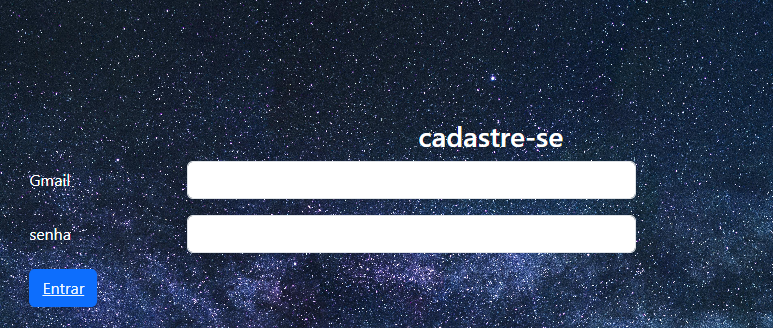
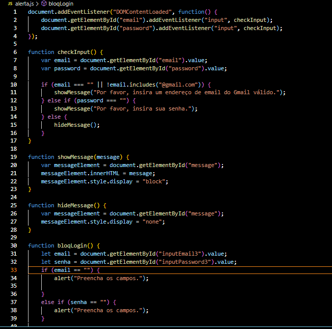
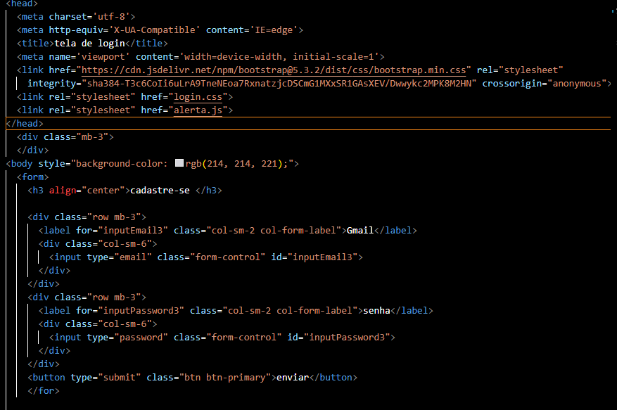
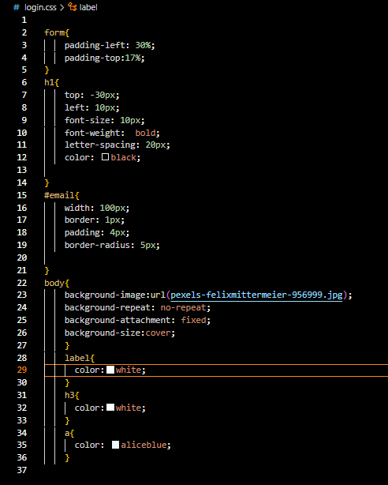

# Tela de login 
Esse trabalho  euma continuação do ano passado, onde usamos javaScript para melhorar ele.
Foi usado o javaScript para quando a pessoa colocar a senha o Gmail incirretos tera uma mensagen informando tambem quado não preincherem algum dos campos tera uma mensagem onde mostrara que não preincheo, e quando a pessoa consegir entrar na sua conta ebrira outra janela ende tera uma mensagem.

 

## tecnologias usadas 

### javaScrpt 
usamos javaScript para fazer fazer modificações no site  como: toda veis que alguem colocar a senha ou gmail errado recevera uma mensagem e tambem quando não prenxer os campos.

## elementos:
* document: do JavaScript, que representa o documento HTML atual carregado no navegador.

* funtion: Funções são usadas para agrupar instruções relacionadas e reutilizáveis. Elas podem aceitar argumentos (parâmetros) e podem retornar um valor.

* else: lse é uma palavra-chave em muitas linguagens de programação, incluindo JavaScript, usada em estruturas condicionais para especificar um bloco de código que deve ser executado se a condição do if não for verdadeira.

* if: if é uma palavra-chave em muitas linguagens de programação, incluindo JavaScript, usada para executar um bloco de código se uma condição especificada for verdadeira.

* else: if é uma palavra-chave em muitas linguagens de programação, incluindo JavaScript, usada para executar um bloco de código se uma condição especificada for verdadeira.

## HTML 
o HTML é usado para criar a estructura basica do site, contendo os elementos basicos aprendidos nas aulas de DSW

* body:o bory eo corpo do html

* html:o html tambem e usado para o corpo do site

* div :e suado para dividir as partes do site.

* label:Elas são importantes para melhorar a acessibilidade e a usabilidade do formulário, além de serem úteis para os usuários entenderem o propósito de cada campo.

* buttom:é usado para criar um botão clicável em uma página HTML.

* form:é usado para criar um formulário em uma página HTML.

* meta: é usado para fornecer metadados sobre o documento HTML.

* link:é usado para fornecer metadados sobre o documento HTML.

* head :é usado para fornecer metadados sobre o documento HTML.

* title:é usado para definir o título do documento HTML.

* h1, h2, h3:Os elementos h1, h2, h3, etc., são usados para definir títulos de cabeçalho em uma página HTML.

## css
o css foi usado para dar mais um poco de esilo no site tendo usado elementos como:

* padding-left, padding-top:padding-left e padding-top são propriedades CSS usadas para definir o espaçamento interno (espaço entre o conteúdo e a borda interna) de um elemento em relação ao lado esquerdo e superior, respectivamente.

* top, left, font-size, font-weight, spacing,color:top e left são propriedades CSS usadas para posicionar um elemento em relação ao seu contêiner pai ou ao elemento pai posicionado,top e left são propriedades CSS usadas para posicionar um elemento em relação ao seu contêiner pai ou ao elemento pai posicionado,font-weight é uma propriedade CSS usada para especificar a espessura da fonte (ou peso da fonte) do texto,
Não é uma propriedade CSS específica, mas pode referir-se ao espaçamento em geral entre elementos em uma página. O espaçamento pode ser controlado usando várias propriedades CSS, como margin e padding, é uma propriedade CSS usada para definir a cor do texto de um elemento.

* width:  uma propriedade CSS usada para definir a largura de um elemento.

* border-radius:border-radius é uma propriedade CSS usada para criar cantos arredondados em um elemento com bordas.

